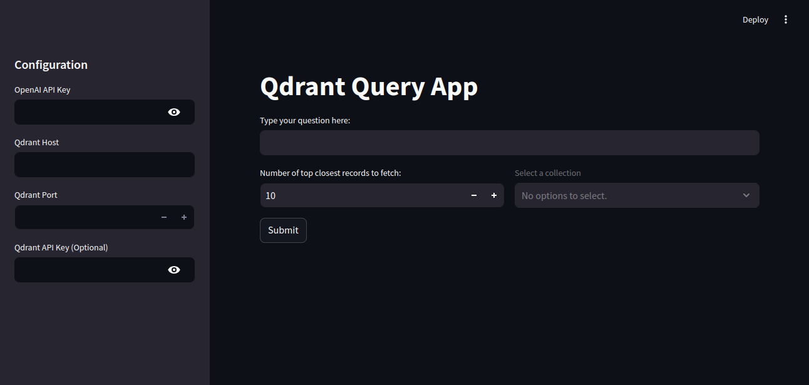
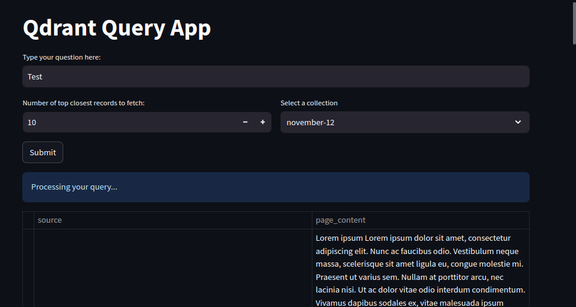

# Qdrant Query App

## Overview
The Qdrant Query App is a Streamlit-based tool for interacting with a Qdrant vector database. It allows users to input queries, retrieve similar records, and view results in a tabular format. OpenAI embeddings enable semantic search, making it easy to find relevant data.

---

## Features

- **Quick Setup:** Configure via `.env` file or directly through the interface.
- **Dynamic Search:** Query Qdrant collections with adjustable result limits.
- **Embedding Support:** Uses OpenAI's `text-embedding-ada-002` for query embeddings.
- **Interactive UI:** View and manage Qdrant collections effortlessly.
- **Tabular Results:** Results displayed in a user-friendly table.

---

## Installation

1. Clone the repository:
   ```bash
   git clone https://github.com/xelpmuzafer/qdrant-query-app.git
   cd qdrant-query-app
   ```

2. Install dependencies:
   ```bash
   pip install -r requirements.txt
   ```

3. Optionally, create a `.env` file:
   ```plaintext
   OPENAI_KEY=your_openai_api_key
   QDRANT_HOST=your_qdrant_host
   QDRANT_PORT=your_qdrant_port
   QDRANT_API_KEY=your_qdrant_api_key  # Optional
   ```

   Alternatively, you can input these values directly in the app interface.

---

## Usage

1. Run the Streamlit app:
   ```bash
   streamlit run app.py
   ```

2. Open the app in your browser (default: `http://localhost:8501`).

3. Configure the app:
   - Enter OpenAI and Qdrant credentials.
   - Select a Qdrant collection.

4. Enter a query, set the result limit, and click **Submit** to fetch results.

5. View results in a tabular format.

---

## Screenshots

### Configuration Sidebar


### Query Input

---

## File Structure

```
.
├── app.py                # Main application script
├── requirements.txt      # Python dependencies
├── README.md             # Documentation
├── .env                  # Environment variables (optional)
├── screenshots/          # Folder containing screenshots
```

---

## Dependencies

- **Streamlit**: Web application framework
- **OpenAI**: OpenAI API client
- **Qdrant-client**: Python client for interacting with Qdrant
- **dotenv**: Manage environment variables
- **Pandas**: Data manipulation and display

Install all dependencies using:
```bash
pip install -r requirements.txt
```

---

## Contributing

1. Fork the repository.
2. Create a new branch:
   ```bash
   git checkout -b feature-name
   ```
3. Make your changes and commit them:
   ```bash
   git commit -m "Add feature"
   ```
4. Push to your fork:
   ```bash
   git push origin feature-name
   ```
5. Submit a pull request.

---

## License

This project is licensed under the MIT License. See the LICENSE file for details.

---

## Acknowledgments

- [Streamlit](https://streamlit.io/)
- [Qdrant](https://qdrant.tech/)
- [OpenAI](https://openai.com/)
